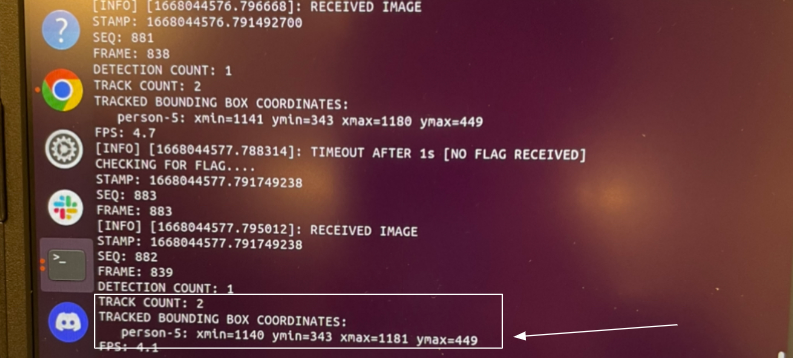
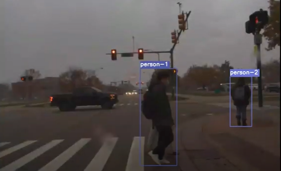
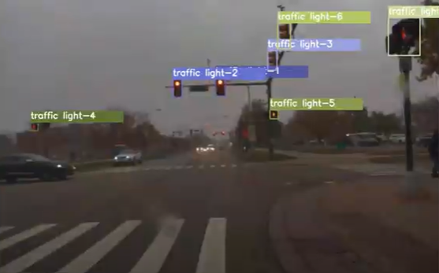
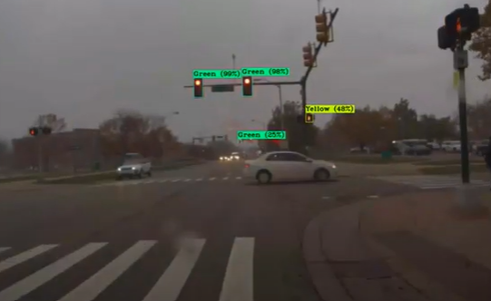

# Sensor Fusion: YOLOv4 + V2X Integration on ROS

This repository contains the code for our project during the second semester of TechLab at MCity with [ADASTEC](https://www.adastec.com/). ADASTEC specializes in the development of L4 autonmated driving software platforms and partners with OEMs to deliver [fully electric, L4 automated buses](https://msutoday.msu.edu/news/2022/new-electric-autonomous-bus-accepts-riders). As part of our Fall 2022 project, we integrated a deep learning model for traffic light detection and classification into a ROS environment for the goal of sensor fusion with V2X SPaT messages. Sensor fusion with camera data (deep learning) and SPaT messages (V2I infrastructure) creates a more robust traffic light handling system. 

The team members for this project are: 
- Daphne Tsai (dvtsai@umich.edu)
- Niyanta Mehra 

## YOLOv4 

For the deep learning model, we used our YOLOv4 model from last semester. See [here](https://github.com/Maithilishetty/Traffic-Light-Recognition/blob/main/README.md) for more details. The model was trained on the [BOSCH Small Traffic Light Dataset](https://hci.iwr.uni-heidelberg.de/content/bosch-small-traffic-lights-dataset) and tested on data provided to us from Adastec.

YOLO is the state-of-the-art object detection and classification model that is used across industry. It supports custom object detection but also works on common datasets such as Pascal VOC, COCO and Open Images dataset. There are many open source pretrained weights available and you can custom train the weights as well. Make sure you have a copy of your custome YOLO model; you will need it once you get the YOLO-ROS wrapper running.

## YOLO-ROS wrapper
Adastec's entire software stack is developed in ROS, including their V2X infrastructure. By integrating the YOLO model into a ROS environment, we will be able to fuse the results collected from deep learning with the SPaT messages. 

A popular wrapper is the [YOLO-ROS wrapper](https://github.com/leggedrobotics/darknet_ros.git) developed by the Robotic Systems Lab - Legged Robotics at ETH Zürich. While this is a viable method for integrating a YOLO model onto ROS, it currently only supports up to YOLOv3. Since we implemented a YOLOv4 model last semester, we will need another wrapper. 

Another wrapper exists online that supports YOLOv4 on ROS Melodic and Ubuntu 18.04, authored by Tim Hudson at the University of Sydney (Sydney, Australia). It was originally designed for detecting pedestrians, and we will modify it such that it can detect and classify traffic lights. This section lays out the general instructions for downloading this wrapper to integrate traffic light detection and classification in ROS.

### Step 1: Download YOLO-ROS wrapper and detect pedestrians
- Set up an instance of Docker on your local machine. For more instructions, see the Docker [website](https://www.docker.com/products/docker-desktop/). This is helpful if your local machine has different versions of ROS and Ubuntu than what you would like to develop in. 
- Make sure you have videos in the form of mp4 files or ROSbags. You will need this later when testing the model.
- Clone the [Pedestrian Tracker Repository](https://gitlab.acfr.usyd.edu.au/thud3888/honours-thesis.git) 
  ```
  git clone https://gitlab.acfr.usyd.edu.au/thud3888/honours-thesis.git
  ```
- Follow the instructions in the repo's ReadMe. At the bottom of this ReadMe, there is a list of problems we encountered and suggestions for how to fix them. You may find this helpful while trying to get the wrapper running on your local machine.

Change the launch file such that it saves the video into an AVI file after the model is done running.
  ```
  cd [path to repo]/pedestrian_analyser/launch
  vim pedestrian_analyser_system.launch
  ```
Now, change lines 22 and 23 to this:
  ```
  <param name="video_flag" value="true" />
  <param name="output_file" value="[path_to_output]/[output_name].avi" />
  ```


Once you get the wrapper running, try giving it some input (mp4 videos or ROSbags) and see if it works! Make sure your input contains pedestrians. While the model is running inside the wrapper, you should see some input:

```
cd [path_to_repo]
roslaunch pedestrian_analyser pedestrian_analyser_system_video.launch video_file_name:="[input_video_path]" output_path:="[output_video_path/video_name.avi]"
```



After the model is done processing the input, you should see an AVI file in your destination path. **Warning:** This process may take a while- it took about 10 minutes to process a 5 second video. Open it up and you should see something like this:



### Step 2: Modify the wrapper to detect traffic lights 

Now that we have an instance of the wrapper running, we would like to change it such that it detects traffic lights intead. Take a look at the COCO dataset, which is what the default YOLOv4 model is trained on. There are 80 classes; one of the classes is "traffic light." We do not need to train the default YOLOv4 model again to detect traffic lights since it was already trained to detect the 80 classes in the COCO dataset. However, we need to modify the wrapper such that the YOLOv4 model knows to detect traffic lights instead of pedestrians. 

Navigate to deepsort_yolo_ros/src/deepsort_yolo_ros.py. 
```
cd [path_to_repo]/deepsort_yolo_ros/src/deepsort_yolo_ros.py
```
Observe the code in lines 207 and 208:
```Python
self.allowed_classes = ['person', 'cell phone']
self.class_colours = {"person": (255, 255, 0), "cell phone": (0, 0, 255)}
 ```

Change it to reflect the classes we want to detect:
```Python
self.allowed_classes = ['traffic light']
self.class_colours = {"traffic light": (255, 255, 0)}
 ```
Now, try giving the wrapper the same input as before. Since we are now detecting traffic lights, the output AVI file should look something like this:



### Step 3: Write a new package to classify traffic lights
We would like the classify traffic lights using our own custom YOLOv4 model, as this provides the necessary information to fuse with data collected from SPaT messages. To do this, we need to write a new package and reroute existing packages inside of the wrapper. We need to write a node package inside of the video playback launch file to read the input from darknet. Navigate to pedestrian_analyser/launch/pedestrian_analyser_system_video.launch. 

```
cd [path_to_repo]/pedestrian_analyser/launch/pedestrian_analyser_system_video.launch
```

Note: this is for the case where the input is in the form of an mp4 file. For ROSbags, modify the pedestrian_analyser/launch/pedestrian_analyser_system_bag.launch. 

Inside of the launch file, insert the following lines of code:
```Python
<launch>

<node pkg="darknet_ros" type="darknet.py" name="darknet_ros" output="screen">

	<param name="display_flag" value="true" />
	<param name="video_flag" value="false" />
	<param name="output_file" value="[output_file_path]/[output_video_name].avi" />
	<param name="confidence_threshold" value="0.2" />

</node>

</launch>
 ```

You should modify the confidence threshold parameter depending on your custom YOLO model. 

Inside of the darknet_ros folder, we want to have all of the relevant files we need for our custom YOLOv4 model. Since the wrapper already has a default YOLOv4 model, we do not need to change the architecture of the neural network. However, we want to make sure we have our custom classes, weights, and config files inside of the darknet_ros folder.

```
cd [path_to_repo]/darknet_ros/src
```

Navigate to darknet_ros/src. Here, create a folder named "data." Inside of this folder, create two more folders, called "classes" and "dataset." 

Inside of "classes," add a file called "bosch.names" (or something similar if you trained your model on another dataset) and insert these classes:
1. RedLeft
2. Red
3. RedRight
4. GreenLeft
5. Green
6. GreenRight
7. Yellow
8. off
These will be the classes that our model will detect inside of the wrapper.

Inside of "dataset," add the dataset you trained the model on. You should compile all of the images in the dataset into a single .txt file. 

Lastly, we need to import our custom trained weights and config files into the darknet_ros folder. Inside of the darknet_ros folder, create a folder called "core." Inside this folder, we should place our custom trained weights and config files for our YOLO model. Please make sure the config file is written in Python! For more information on config files in Python, see [here](https://medium.com/analytics-vidhya/how-to-write-configuration-files-in-your-machine-learning-project-47bc840acc19).

Now, try giving the wrapper the same input as before. Since we are now classifying traffic lights, the output AVI file should look something like this:



## Problems and Potential Solutions
When it comes to working with open source code, you will often encounter lots of bugs and issues along the way. This section lays out the problems we encountered (hardware and software) and some potential solutions.

### Hardware

Make sure your machine has a NVIDIA GPU (in contrast to an AMD GPU). The models used in the wrapper utilize CUDA, which is mostly only compatible with NVIDIA GPUs. To ensure maximum compatibility and reduce the number of hardware issues you might face, you should run the wrapper on a Linux machine. 
To install the NVIDIA drivers, see the NVIDIA driver installation toolkit [here](https://docs.nvidia.com/datacenter/tesla/tesla-installation-notes/index.html).

To install CUDA on your machine, see the CUDA Toolkit Documentation [here](https://docs.nvidia.com/cuda/).

If you run the wrapper inside a Docker container, you will not need to install any local instances of ROS or Ubuntu. If you are running the wrapper locally, see below for some tips on installing the correct version of ROS and Ubuntu:

Install the appropiate ROS version [here](http://wiki.ros.org/ROS/Installation).
Downgrade to a compatible version of Ubuntu by checking out this [help guide](https://askubuntu.com/questions/49869/how-to-roll-back-ubuntu-to-a-previous-version).

Note: The YOLO-ROS wrapper works with different versions of both. For YOLOv3, the wrapper supports ROS Noetic and Ubuntu 20.04. For YOLOv4, currenty the wrapper only supports ROS Melodic and Ubuntu 18.04. 

For a great Linux machine, check out the laptops made by [System76](https://system76.com/laptops). They're my personal favorite when it comes to reliable Linux machines.

### Software 

You might encounter an error where the system says it cannot find the libdarknet.so file as documented [here](https://github.com/pjreddie/darknet/issues/428). This is because the wrapper clones an uncompatible version of darknet. To fix this, we need to do a few things:

First, navigate to your lib folder.
```
cd /usr/lib
```
Clone the correct darknet.
```
git clone https://github.com/AlexeyAB/darknet.git
cd /darknet/
```
Inside of the Makefile, change line 7 to:
```
LIBSO=1
```
To edit the Makefile inside your terminal, you may need to install vim.
```
sudo-apt install vim
```
Then follow the [instructions](https://pjreddie.com/darknet/install/) to run the darknet.

To copy files from your local machine to the Docker container, first navigate to a new terminal and type this:
```
docker ps
```
You will get an code representing the instance of the Docker container. Copy the files into the Docker container:
```
docker cp [path_to_files] code:[path_to_folder_on_container]
```
Check out this [video](https://www.youtube.com/watch?v=M9aM6Jir-is) for more information.

You might also need an AVI decoder to be able to watch the video on your Linux machine. Luckily, the system will give suggestions as to which software to install, and you simply need to click on one of them to install it. 

## References:

1. <a href="https://github.com/AlexeyAB/darknet"> YOLO Darknet </a>
2. <a href="https://github.com/Maithilishetty/Traffic-Light-Recognition"> YOLOv4 model trained on Bosch Dataset</a>
3. <a href="https://github.com/leggedrobotics/darknet_ros.git"> YOLOv3 Wrapper for ROS Integration</a>
4. <a href="https://gitlab.acfr.usyd.edu.au/thud3888/honours-thesis.git"> YOLOv4 Wrapper for ROS Integration</a>